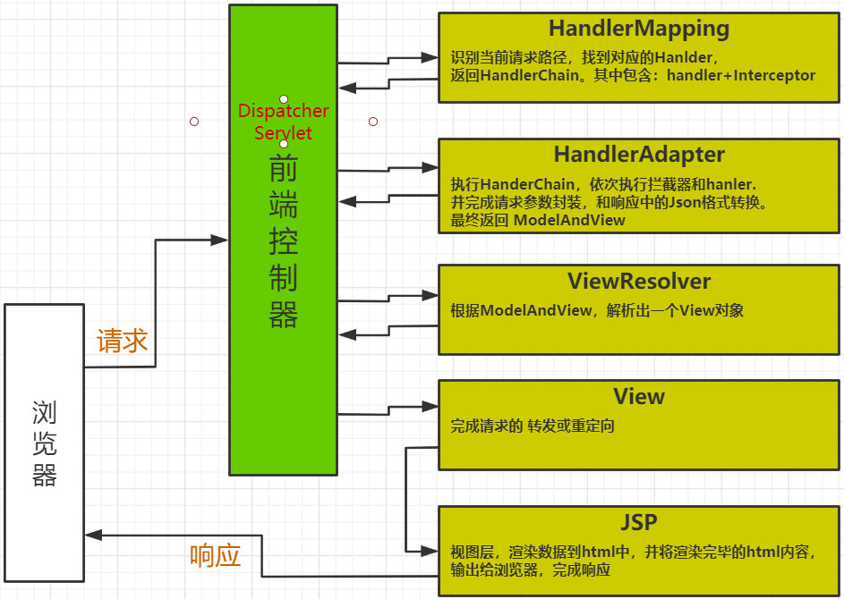

> Author：Shine
>
> Version：9.0.2

[TOC]


### 一、SpringMVC

---

#### 1.1 引言

> **java开源框架，Spring Framework的一个独立模块。**
>
> **MVC框架,在项目中开辟MVC层次架构**    
>
> **对控制器中的功能 包装 简化 扩展践行工厂模式，功能架构在工厂之上**

MVC](https://baike.baidu.com/item/MVC)全名是Model View Controller，是模型(model)－视图(view)－控制器(controller)的缩写，一种软件设计典范，用一种业务逻辑、数据、界面显示分离的方法组织代码，将业务逻辑聚集到一个部件里面，在改进和个性化定制界面及用户交互的同时，不需要重新编写业务逻辑。MVC被独特的发展起来用于映射传统的输入、处理和输出功能在一个逻辑的图形化用户界面的结构中。

#### 1.2 MVC架构

##### 1.2.1 概念

| 名称       | 职责                                                         |
| ---------- | ------------------------------------------------------------ |
| Model      | 模型：承载数据，并对用户提交请求进行计算的模块。其分为两类，一类称为数据承载 Bean，一类称为业务处理 Bean。所谓数据承载 Bean 是指实体类，专门用户承载业务数据的，如 Student、User 等。而业务处理 Bean 则是指 Service 或 Dao 对象， 专门用于处理用户提交请求的。 |
| View       | 视图：为用户提供使用界面，与用户直接进行交互。               |
| Controller | 控制器：用于将用户请求转发给相应的 Model 进行处理，并根据 Model 的计算结果向用户提供相应响应。 |

MVC 架构程序的工作流程

- 用户通过 View 页面向服务端提出请求，可以是表单请求、超链接请求、AJAX 请求等

- 服务端 Controller 控制器接收到请求后对请求进行解析，找到相应的 Model 对用户请求进行处理

- Model 处理后，将处理结果再交给 Controller

- Controller 在接到处理结果后，根据处理结果找到要作为向客户端发回的响应 View 页面。页面经渲染（数据填充）后，再发送给客户端。

  


##### 1.2.2 好处

> * MVC是现下软件开发中的最流行的代码结构形态;
>
> * 人们根据负责的不同逻辑，将项目中的代码分成 M V C 3个层次;
>
> * 层次内部职责单一，层次之间耦合度低;
>
> * 符合低耦合 高内聚的设计理念。也实际有利于项目的长期维护。

#### 1.3MVC体系

​    Spring MVC框架围绕DispatcherServlet这个核心展开,DispatcherServlet是Spring MVC的总导演,总策划.它负责截获请求并将其分派给相应的处理器处理.Spring MVC框架包括注解驱动控制器,请求及响应的信息处理,视图解析,本地化解析,上传文件解析,异常处理及表单标签绑定内容等...

DispatcherServlet要做到这点,需要我们把所有的请求都发送到他那里

**Spring核心组件**


**组件介绍**

DispatcherServlet：作为前端控制器，整个流程控制的中心，控制其它组件执行，统一调度，降低组件之间的耦合性，提高每个组件的扩展性。

HandlerMapping：通过扩展处理器映射器实现不同的映射方式，例如：配置文件方式，实现接口方式，注解方式等。 

HandlerMapping:在项目启动时加载,就是一个映射仓库,配置一些周边信息参数\返回值信息

HandlAdapter：通过扩展处理器适配器，支持更多类型的处理器,调用处理器传递参数等工作!

处理器适配器,也就是用来接收处理器.

ViewResolver：通过扩展视图解析器，支持更多类型的视图解析，例如：jsp、freemarker、pdf、excel等。

**Spring MVC执行流程**

​					 	   

​    从接收请求到响应,Spring MVC框架的众多组件通力配合,各司其职,有条不紊的完成分内工作!在整个框架中,DispatchserServlet处于核心的位置,它负责协调和组织不同组件以完成请求处理以及返回影响工作.和大多数Web MVC框架一样,Spring MVC 通过一个前段的Servlet接收所有请求,并将这些工作委托给其他组件进行处理,DispatcherServlet 就是Spring MVC的前段Servlet。下面对Spring MVC处理请求的整体过程进行详解!

1. 整个过程始于客户端发出的一个HTTP请求,WEB应用服务器接收到这个请求，如果匹配DispatcherServlet的映请求映射路径(web.xml中指定),则Web容器将该请求转交给DispatcherServlet处理。
2. 接收到这个请求后,将根据请求的信息(包括 URL,HTTP方法,请求头,请求参数,Cookie等)及HandlerMapping的配置找到处理请求的处理器(Handler)。可将HandlerMapping看做路由控制器,将Handler看做目标主机.值得注意的是,在Spring MVC中并没有定义一个Handler接口,实际上,任何一个Object都可以成为请求处理器。
3. 当DispatcherServlet根据HandlerMapping得到对应当前请求的Handler后,通过HandlerAdapter对Handler的封装,再以统一的适配器接口调用Handler。HandlerAdapter是Spring MVC的框架级接口,顾名思义,HandlerAdapter是一个适配器,它用统一的接口对各种Handler的方法进行调用.
4. 处理器完成业务逻辑的处理后将返回一个ModelAndView给DispatcherServlet,ModelAndView包含了视图逻辑名和模型数据信息。
5. ModelAndView中包含的是"逻辑视图名"而并非真正的视图对象,DispatcherServlet借由ViewResolver完成逻辑视图名到真实视图对象的解析工作。
6. 当得到真实的视图对象View后,DispatcherServlet就使用这个View对象对ModelAndView中的模型数据进行视图渲染。
7. 最终客户端得到的响应信息可能是一个普通的HTML页面,也可能是一个XML或者JSON串,甚至是一张图片或者一个PDF文档等不同的媒体形式。


**组件开发实现情况**

**1、前端控制器DispatcherServlet（不需要工程师开发）,由框架提供**
作用：接收请求，响应结果，相当于转发器，中央处理器(有人称之为前端处理器)。有了dispatcherServlet减少了其它组件之间的耦合度。
用户请求到达前端控制器，它就相当于mvc模式中的c，dispatcherServlet是整个流程控制的中心，由它调用其它组件处理用户的请求，dispatcherServlet的存在降低了组件之间的耦合性。

**2、处理器映射器HandlerMapping(不需要工程师开发),由框架提供**
作用：根据请求的url查找Handler(包裹执行方法的一个类)

找不到返回404

uri仅仅是后面的,url包括前面的,协议网址端口等信息.

HandlerMapping负责根据用户请求找到Handler即处理器，springmvc提供了不同的映射器实现不同的映射方式，例如：配置文件方式，实现接口方式，注解方式等。

**3、处理器适配器HandlerAdapter**
作用：按照特定规则（HandlerAdapter要求的规则）去执行Handler
通过HandlerAdapter对处理器进行执行，这是适配器模式的应用，通过扩展适配器可以对更多类型的处理器进行执行。

处理器适配器会提前做一些工作,解析\接受数据\封装\转换\验证数据

**4、处理器Handler(需要工程师开发)**
**注意：编写Handler时按照HandlerAdapter的要求去做，这样适配器才可以去正确执行Handler**
Handler是具体执行操作的代码

Handler 是继DispatcherServlet前端控制器的后端控制器，在DispatcherServlet的控制下Handler对具体的用户请求进行处理。
由于Handler涉及到具体的用户业务请求，所以一般情况需要工程师根据业务需求开发Handler。

**5、视图解析器View resolver(不需要工程师开发),由框架提供**
作用：进行视图解析，根据逻辑视图名解析成真正的视图（view）
ViewResolver负责将处理结果生成View视图，View 
Resolver首先根据逻辑视图名解析成物理视图名即具体的页面地址，再生成View视图对象，最后对View进行渲染将处理结果通过页面展示给用户。
 springmvc框架提供了很多的View视图类型，包括：jstlView、freemarkerView、pdfView等。
一般情况下需要通过页面标签或页面模版技术将模型数据通过页面展示给用户，需要由工程师根据业务需求开发具体的页面。

**6、视图View(需要工程师开发jsp...)**
View是一个接口，实现类支持不同的View类型（jsp、freemarker、pdf...）

  

### 二、开发流程

---


#### 2.1 pom.xml

```xml
<?xml version="1.0" encoding="UTF-8"?>
<project xmlns="http://maven.apache.org/POM/4.0.0"
         xmlns:xsi="http://www.w3.org/2001/XMLSchema-instance"
         xsi:schemaLocation="http://maven.apache.org/POM/4.0.0 http://maven.apache.org/xsd/maven-4.0.0.xsd">
    <modelVersion>4.0.0</modelVersion>

    <groupId>org.banyuan.study</groupId>
    <artifactId>hello-springmvc</artifactId>
    <version>1.0-SNAPSHOT</version>
    <packaging>war</packaging>

    <dependencies>
        <dependency>
            <groupId>org.springframework</groupId>
            <artifactId>spring-webmvc</artifactId>
            <version>5.1.6.RELEASE</version>
        </dependency>
    </dependencies>

</project>
```

#### 2.2 配置核心(前端)控制器

> 作为一个MVC框架，首先要解决的是：如何能够收到请求！
>
> 所以MVC框架大都会设计一款前端控制器，选型在 Servlet 或 Filter两者之一,在框架最前沿率先工作，接收所有请求。
>
> 此控制器在接收到请求后，还会负责springMVC的核心的调度管理，所以既是前端又是核心。

```xml
<?xml version="1.0" encoding="UTF-8"?>
<web-app xmlns="http://xmlns.jcp.org/xml/ns/javaee"
         xmlns:xsi="http://www.w3.org/2001/XMLSchema-instance"
         xsi:schemaLocation="http://xmlns.jcp.org/xml/ns/javaee http://xmlns.jcp.org/xml/ns/javaee/web-app_4_0.xsd"
         version="4.0">

    <!--servlet : 接收返回数据
            : 代码太多了(废代码太多了) 功能不紧凑  接收和返回数据麻烦
            : 转发重定向麻烦
    springmvc :-->

    <servlet>
        <servlet-name>springmvc</servlet-name>
        <servlet-class>org.springframework.web.servlet.DispatcherServlet</servlet-class>
        <init-param>
            <param-name>contextConfigLocation</param-name>
            <param-value>classpath:springmvc.xml</param-value>
        </init-param>
    </servlet>
    <servlet-mapping>
        <servlet-name>springmvc</servlet-name>
        <url-pattern>/</url-pattern>
    </servlet-mapping>
    
</web-app>
```

#### 2.3 后端控制器

> 等价于之前定义的Servlet

```java
package com.banyuan.study.controller;

import org.springframework.stereotype.Controller;
import org.springframework.web.bind.annotation.RequestMapping;

/**
 * @author poi 2021/5/30 9:26
 * @version 1.0
 * 2021/5/30 9:26
 */
@Controller
public class UserController {

    //导包 : aop bean core context exp web webmvc logging
    //在web.xml中配置 中央控制器 DispatcherServlet 配置路径为 /
    // 给中央控制器一个springmvc的配置文件地址  classpath: springmvc.xml
    // 配置springmvc.xml(springmvc的配置文件)
    //  扫描类   扫描类中方法  配置视图解析器
    // 书写Controller类
    // 类上要打上@Controller注解  方法上要打上 @ReqeustMapping("路径")
    // 返回值是一个字符串,


    @RequestMapping("/user/toRegister")
    public String toRegister() {

        return "/WEB-INF/pages/register.jsp";
    }
}
```

#### 2.4 配置文件

> 默认名称：核心控制器名-servet.xml     默认位置：WEB-INF
>
> 随意名称：springmvc.xml           随意位置：resources    但需要配置在核心控制器中

```xml
<beans 	xmlns="http://www.springframework.org/schema/beans"
          xmlns:context="http://www.springframework.org/schema/context"
          xmlns:mvc="http://www.springframework.org/schema/mvc"
          xmlns:xsi="http://www.w3.org/2001/XMLSchema-instance"
          xsi:schemaLocation="http://www.springframework.org/schema/beans
							http://www.springframework.org/schema/beans/spring-beans.xsd
							http://www.springframework.org/schema/context
							http://www.springframework.org/schema/context/spring-context.xsd
							http://www.springframework.org/schema/mvc
							http://www.springframework.org/schema/mvc/spring-mvc.xsd">
    <!--第一步 扫描类-->
    <!-- 告知springmvc  哪些包中 存在 被注解的类 -->
    <context:component-scan base-package="com.banyuan.study.controller"/>

    <!--第二步 拿到扫描到的类, 抽取方法和路径,形成一一对象关系-->
    <!-- 注册注解开发驱动 -->
    <mvc:annotation-driven>
    </mvc:annotation-driven>

    <!--第三步 配置视图解析器 : 解析方法运行完之后的返回值-->
    <bean class="org.springframework.web.servlet.view.InternalResourceViewResolver">
    </bean>

</beans>
```

#### 2.5 页面

index.jsp

```jsp
<%--
  Created by IntelliJ IDEA.
  User: 76502
  Date: 2021/5/24
  Time: 21:28
  To change this template use File | Settings | File Templates.
--%>
<%@ page contentType="text/html;charset=UTF-8" language="java" %>
<html>
<head>
    <title>Title</title>
</head>
<body>
    <h1>hello world</h1>
</body>
</html>
```

register.jsp

```xml
<%--
  Created by IntelliJ IDEA.
  User: 76502
  Date: 2021/5/24
  Time: 21:28
  To change this template use File | Settings | File Templates.
--%>
<%@ page contentType="text/html;charset=UTF-8" language="java" %>
<html>
<head>
    <title>Title</title>
</head>
<body>
    <h1>注册页面</h1>
</body>
</html>
```

#### 2.6 访问

配置tomcat之后，就可以访问了

```markdown
http://localhost:8080/mvc/
http://localhost:8080/mvc/user/toRegister
```

2.8补充

springmvc.xml补充

```
<!--配置视图解析器 : 解析方法运行完之后的返回值-->
<bean class="org.springframework.web.servlet.view.InternalResourceViewResolver">
    <property name="prefix" value="/WEB-INF/pages/"/>
    <property name="suffix" value=".jsp"/>
</bean>
```

### 三、接收请求参数

---

#### 3.1 基本类型参数

> 请求参数和方法的形参 同名即可

> springMVC默认可以识别的日期字符串格式为： YYYY/MM/dd HH:mm:ss
> 通过@DateTimeFormat可以修改默认日志格式

```java
// id  name gender
// http://localhost:8080/mvc/test1?id=1&name=zzz&gender=false&birth=2018-12-12%2012:20:30
    @RequestMapping("/user/register1")
    public String testParam1(Integer id,
                             String name,
                             Boolean gender,
                             @DateTimeFormat(pattern = "yyyy-MM-dd HH:mm:ss") Date birth) {
        System.out.println("test param1");
        System.out.println("id:" + id);
        System.out.println("name:" + name);
        System.out.println("gender:" + gender);
        System.out.println("birth:" + birth);

        return "register";
    }
```

register.jsp

```xml
<%--
  Created by IntelliJ IDEA.
  User: 76502
  Date: 2021/5/24
  Time: 21:28
  To change this template use File | Settings | File Templates.
--%>
<%@ page contentType="text/html;charset=UTF-8" language="java" %>
<html>
<head>
    <title>Title</title>
</head>
<body>
    <h1>注册页面</h1>
    <form action="register1">
        用户名: <input name="name"> <br>
        密码: <input name="password" type="password"> <br>
        确认密码: <input name="repassword" type="password"> <br>
        <input type="submit">
    </form>register.jsp
</body>
</html>

```


#### 3.2 实体收参【`重点`】

> 请求参数和实体的属性 同名即可

```java
package com.banyuan.study.bean;

import lombok.Data;
import org.springframework.format.annotation.DateTimeFormat;

import java.util.Date;

/**
 * @author poi 2021/5/30 11:50
 * @version 1.0
 * 2021/5/30 11:50
 */
@Data
public class User {
    private Integer id;
    private String name;
    @DateTimeFormat(pattern="yyyy-MM-dd")
    private Date birth;
    private Boolean gender;
}

//http://localhost:8080/mvc/user/register?id=1&name=zzz&gender=false&birth=2018-12-12%2012:20:30
    @RequestMapping("/user/register2")
    public String testParam2(User user){
        System.out.println("test param2");
        System.out.println("user:"+user);
        return "register";
    }
```

register.jsp

```
<%--
  Created by IntelliJ IDEA.
  User: 76502
  Date: 2021/5/24
  Time: 21:28
  To change this template use File | Settings | File Templates.
--%>
<%@ page contentType="text/html;charset=UTF-8" language="java" %>
<html>
<head>
    <title>Title</title>
</head>
<body>
    <h1>注册页面</h1>
    <form action="register2">
        用户名: <input name="name"> <br>
        密码: <input name="password" type="password"> <br>
        确认密码: <input name="repassword" type="password"> <br>
        <input type="submit">
    </form>register.jsp
</body>
</html>
```

#### 3.3 数组收参

> 简单类型的 数组

```html
<form>
    ......
    <input type="checkbox" name="hobby" value="fb"/>足球 
    <input type="checkbox" name="hobby" value="bb"/>篮球 
    <input type="checkbox" name="hobby" value="vb"/>排球
    
</form>
```

```java
//http://localhost:8080/mvc/test3?hobby=football&hobby=basketball
@RequestMapping("/test3")
public String testParam3(String[] hobby){
    for(String h:hobby){
        System.out.print(h+" ");
    }
    return "register";
}
```


#### 3.4 路径参数 (restful风格） 

```java
// {id} 定义名为id的路径；【/test4/{id}】的匹配能力和【/test4/*】等价
// http://localhost:8080/mvc/test4/10   {id}匹配到10
@RequestMapping("/test4/{id}")
// @PathVariable将{id}路径匹配到值赋给id参数
// 路径名和参数名相同则@PathVariable("id")可简写为 @PathVariable
public String testParam4(@PathVariable("id") Integer id){
    System.out.println("id:"+id);            
    return "register";
}

// http://localhost:8080/mvc/test5/tom   {username}匹配到tom
@RequestMapping("/test5/{username}")
public String testParam5(@PathVariable("username") String name){//将{username}路径匹配到的值赋给name参数
    System.out.println("username:"+name);
    return "register";
}
```

#### 3.6 中文乱码

> 首先，页面中字符集统一

```jsp
JSP : <%@page  pageEncoding="utf-8" %>
HTML : <meta charset="UTF-8">
```

> 其次，tomcat中字符集设置，对get请求中，中文参数乱码有效

```markdown
Tomcat配置：URIEncoding=utf-8
```

> 最后，设置此filter，对post请求中，中文参数乱码有效

web.xml

```xml
<!-- 此过滤器会进行：request.setCharactorEncoding("utf-8"); -->
<filter>
    <filter-name>encoding</filter-name>
    <filter-class>org.springframework.web.filter.CharacterEncodingFilter</filter-class>
    <init-param>
        <param-name>encoding</param-name>
        <param-value>utf-8</param-value>
    </init-param>
</filter>
<filter-mapping>
    <filter-name>encoding</filter-name>
    <url-pattern>/*</url-pattern>
</filter-mapping>
```


### 四、跳转

---

#### 4.1 转发

```java
package com.banyuan.study.controller;

import org.springframework.stereotype.Controller;
import org.springframework.web.bind.annotation.RequestMapping;

/**
 * @author poi 2021/5/30 17:56
 * @version 1.0
 * 2021/5/30 17:56
 */
@Controller
@RequestMapping("/skip")
public class SkipController {

    @RequestMapping("/toHomePage")
    public String toHomePage(){
        return "home";
    }
//http://localhost:8080/mvc/skip/forward1
    @RequestMapping("/forward1")
    public String testForward(){
        System.out.println("test forward1");
        // 转发跳转 /pages/forward.jsp
        // return "forward";//和下一行等价
        return "forward:/WEB-INF/pages/forward.jsp";
    }
    http://localhost:8080/mvc/skip/forward2
    @RequestMapping("/forward2")
    public String testForward2(){
        System.out.println("test forward2");
        //转发到  /skip/forward1
        return "forward:forward1";//相对路径(转发到本类中的test1)
        //转发到  /skip/forward1
        //return "forward:/skip/forward1"; //绝对路径
    }
}
```

#### 4.2 重定向

```java
    //http://localhost:8080/mvc/skip/redirect1
    @RequestMapping("/redirect1")
    public String testRedirect1(){
        System.out.println("test redirect1");
        //重定向到 /redir/toHomePage
        return "redirect:toHomePage"; //相对路径(转发到本类中的toHomePage)
        //return "redirect:/skip/toHomePage";//绝对路径
    }
    //http://localhost:8080/mvc/skip/redirect2
    @RequestMapping("/redirect2")
    public String testRedirect2(){
        System.out.println("test redirect2");
        //重定向到 index.jsp
        return "redirect:/index.jsp";
    }
```

#### 4.3 跳转细节

> * 在增删改之后，为了防止请求重复提交，重定向跳转
>
> * 在查询之后，可以做转发跳转

#### 4.4 转发(Forward)和重定向(Redirect)的区别

**转发是服务器行为，重定向是客户端行为。**

**转发（Forward）** 通过RequestDispatcher对象的forward（HttpServletRequest  request,HttpServletResponse  response）方法实现的。

重定向（Redirect）是利用服务器返回的状态码来实现的。客户端浏览器请求服务器的时候，服务器会返回一个状态码。服务器通过 HttpServletResponse的 setStatus(int status)方法设置状态码。如果服务器返回301或者302，则浏览器会到新的网址重新请求该资源。

**从地址栏显示来说**

forward是服务器请求资源,服务器直接访问目标地址的URL,把那个URL的响应内容读取过来,然后把这些内容再发给浏览器.浏览器根本不知道服务器发送的内容从哪里来的,所以它的地址栏还是原来的地址. redirect是服务端根据逻辑,发送一个状态码,告诉浏览器重新去请求那个地址.所以地址栏显示的是新的URL.

**从数据共享来说**

forward:转发页面和转发到的页面可以共享request里面的数据. redirect:不能共享数据.

**从运用地方来说**

forward:一般用于用户登陆的时候,根据角色转发到相应的模块. redirect:一般用于用户注销登陆时返回主页面和跳转到其它的网站等

**从效率来说**

forward:高. redirect:低.

### 五、传值

---

> C得到数据后，跳转到V，并向V传递数据。进而V中可以渲染数据，让用户看到含有数据的页面
>
> 转发跳转：Request作用域
>
> 重定向跳转：Session作用域

#### 5.1 Request和Session

添加依赖

```xml
        <dependency>
            <!-- servlet编译环境 -->
            <groupId>javax.servlet</groupId>
            <artifactId>javax.servlet-api</artifactId>
            <version>3.1.0</version>
            <scope>provided</scope>
        </dependency>
        <dependency>
            <!-- jsp编译环境 -->
            <groupId>javax.servlet</groupId>
            <artifactId>jsp-api</artifactId>
            <version>2.0</version>
            <scope>provided</scope>
        </dependency>
```


```java
//形参中 即可获得 request 和 session对象

    //http://localhost:8080/mvc/skip/forwardData
    @RequestMapping("/forwardData")
    public String testForward(HttpSession session, HttpServletRequest req, Integer id){
        System.out.println("test forwardData");
        
        User sessionUser = new User();
        sessionUser.setBirth(new Date());
        sessionUser.setId(1);
        
        session.setAttribute("user",sessionUser);
        req.setAttribute("age", 18);
        req.setAttribute("users", Arrays.asList(sessionUser));
        // 转发跳转 /pages/forward.jsp
        return "forward:/index.jsp";
    }

    //http://localhost:8080/mvc/skip/redirectData
    @RequestMapping("/redirectData")
    public String testRedirectData(HttpSession session, HttpServletRequest req){
        System.out.println("test testRedirectData");

        User sessionUser = new User();
        sessionUser.setBirth(new Date());
        sessionUser.setId(1);

        session.setAttribute("user",sessionUser);
        req.setAttribute("age", 18);
        req.setAttribute("users", Arrays.asList(sessionUser));

        //重定向到 index.jsp
        return "redirect:/index.jsp";
    }


```

#### 5.2 JSP中取值

> 建议：重点复习 EL  JSTL

```jsp
//jsp中用EL表达式 取值即可
    <fmt:formatDate value="${sessionScope.user.birth}" pattern="yyyy-MM-dd"/> <br/>
    ${sessionScope.user.birth} <br>
    ${sessionScope.user.id} <br>
    ${requestScope.age}
```

#### 5.3 Model

```java

package com.banyuan.study.controller;

import com.banyuan.study.bean.User;
import org.springframework.stereotype.Controller;
import org.springframework.ui.Model;
import org.springframework.web.bind.annotation.RequestMapping;

import javax.servlet.http.HttpServletRequest;
import javax.servlet.http.HttpSession;
import java.util.Arrays;

/**
 * @author poi 2021/5/30 21:48
 * @version 1.0
 * 2021/5/30 21:48
 */
@Controller
@RequestMapping("/model")
public class ModelController {

    //http://localhost:8080/mvc/model/model
    //model中的数据，会在V渲染之前，将数据复制一份给request
    @RequestMapping("/model")
    public String testData(Model model){
        model.addAttribute("name", "张三");
        return "home";
    }


}

//jsp中用EL表达式 取值即可
${requestScope.name}
```

#### 5.4 ModelAndView

```java
//modelandview 可以集中管理 跳转和数据
    //http://localhost:8080/mvc/model/modelAndView
    @RequestMapping("/modelAndView")
    public ModelAndView testData(){//返回值类型为ModelAndView
        //新建ModelAndView对象
        ModelAndView mv = new ModelAndView();
        // 设置视图名，即如何跳转
        mv.setViewName("forward:/index.jsp");
        // 增加数据
        mv.addObject("age",19);
        return mv;
    }

//jsp中用EL表达式 取值即可
${requestScope.age}
```

#### 5.5 @SessionAttributes

> * @SessionAttributes({"gender","name"})  ：model中的 name和gender 会存入session中
>
> * SessionStatus 移除session

```java
package com.banyuan.study.controller;

import org.springframework.stereotype.Controller;
import org.springframework.ui.Model;
import org.springframework.web.bind.annotation.RequestMapping;
import org.springframework.web.bind.annotation.SessionAttributes;
import org.springframework.web.bind.support.SessionStatus;
import org.springframework.web.servlet.ModelAndView;

/**
 * @author poi 2021/5/30 21:58
 * @version 1.0
 * 2021/5/30 21:58
 */
@Controller
@RequestMapping("/session")
@SessionAttributes({"gender","name"}) // model中的 name和gender 会存入session中
public class SessionController {

    //http://localhost:8080/mvc/session/addToSession
    @RequestMapping("/addToSession")
    public String hello(Model m){
        m.addAttribute("gender",true); // 会存入session
        m.addAttribute("name","lisi"); // 会存入session
        return "home";
    }

    //http://localhost:8080/mvc/session/removeFromSession
    @RequestMapping("/removeFromSession")
    public String hello(SessionStatus status){
        // 移除通过SessionAttributes存入的session
        status.setComplete();
        return "home";
    }
    ${sessionScope.gender} <br>
    ${sessionScope.name} <br>
```


### 六、静态资源

---

#### 6.1 静态资源问题

> 静态资源：html，js文件，css文件，图片文件

> 静态文件没有url-pattern,所以默认是访问不到的，之所以可以访问，是因为，tomcat中有一个全局的servlet：org.apache.catalina.servlets.DefaultServlet，它的url-pattern是 "/",是全局默认的Servlet.  所以每个项目中不能匹配的静态资源的请求，有这个Servlet来处理即可。

> 但，在SpringMVC中DispatcherServlet也采用了 “/” 作为url-pattern, 则项目中不会再使用全局的Serlvet，则静态资源不能完成访问。
>

#### 6.2 解决方案1

> DispathcerServlet采用其他的url-pattern
>
> 此时，所有访问handler的路径都要以 action结尾！！

```xml
<servlet>
  	<servlet-name>mvc9</servlet-name>
  	<servlet-class>org.springframework.web.servlet.DispatcherServlet</servlet-class>
</servlet>
<servlet-mapping>
    <servlet-name>mvc9</servlet-name>
    <url-pattern>*.action</url-pattern>
</servlet-mapping>
```

#### 6.3 解决方案2

> DispathcerServlet的url-pattern依然采用 "/",但追加配置

```xml
<!-- 
  额外的增加一个handler，且其requestMapping:  "/**" 可以匹配所有请求，但是优先级最低
  所以如果其他所有的handler都匹配不上，请求会转向 "/**" ,恰好，这个handler就是处理静态资源的
  处理方式：将请求转会到tomcat中名为default的Servlet
  -->
<mvc:default-servlet-handler/>
```

#### 6.4 解决方案3

> * mapping是访问路径，location是静态资源存放的路径
> * 将/html/** 中 /**匹配到的内容，拼接到 /hhh/后
>   http://..../html/a.html  访问 /hhh/a.html

```xml
<mvc:resources mapping="/html/**" location="/hhh/"/>
```

### 七、Json处理

---

#### 7.1 导入依赖

```xml
<!-- Jackson springMVC默认的Json解决方案选择是 Jackson，所以只需要导入jackson的jar，即可使用。-->
<dependency>
    <groupId>com.fasterxml.jackson.core</groupId>
    <artifactId>jackson-databind</artifactId>
    <version>2.9.8</version>
</dependency>
//导入包的形式 :
	jackson-core-2.10.4.jar
	jackson-annotations-2.10.5.jar
	jackson-databind-2.9.8.jar
```

#### 7.2 使用@ResponseBody

```java
@Controller
public class JsonController{    
	@RequestMapping("/test1")
    @ResponseBody //将handler的返回值，转换成json(jackson),并将json响应给客户端。
    public User hello1(){
        System.out.println("hello world");
        User user = new User();
        return user;
    }
    // @ResponseBody还可以用在handler的返回值上
    @RequestMapping("/test2")
    public @ResponseBody List<User> hello2(){
        System.out.println("hello world");
        List<User> users = Arrays.asList(new User(),new User());
        return users;
    }
    // 如果返回值已经是字符串，则不需要转json，直接将字符串响应给客户端 
    @RequestMapping(value="/test3",produces = "text/html;charset=utf-8") //produces 防止中文乱码
    @ResponseBody 
    public String hello2(){
        System.out.println("hello world");
        return "你好";
    }
}
```

#### 7.3 使用@RestController

> Controller类上加了@RestController注解，等价于在类中的每个方法上都加了@ResponseBody

```java
@Controller
@RestController
public class JsonController{
    @RequestMapping("/test1")
    public User hello1(){
        System.out.println("hello world");
        User user = new User();
        return user;
    }
    //@ResponseBody还可以用在handler的返回值上
    @RequestMapping("/test2")
    public List<User> hello2(){
        System.out.println("hello world");
        List<User> users = Arrays.asList(new User(),new User());
        return users;
    }
}
```


#### 7.4 使用@RequestBody

> #### **@RequestBody**, 接收Json参数

##### 7.4.1 定义Handler

```java
class User{
    private Integer id;
    private String name;
    private Boolean gender;
    //set get
}
```

```java
@RequestMapping("/users")
public String addUser(@RequestBody User user){//@RequestBody将请求体中的json数据转换为java对象
    System.out.println("cap2");
    System.out.println("Post user :"+user);
    return "index";
}
```

##### 7.4.2 Ajax发送json

```js
var xhr = new XMLHttpRequest();
xhr.open("post","${pageContext.request.contextPath}/users?"+new Date().getTime());
xhr.setRequestHeader("content-type","application/json");//设置请求头
xhr.send('{"id":1,"name":"shine","gender":"true"}');//传递json串
```

```javascript
//ajax
var user = {id:1,name:"shine"};
$.ajax({
    url:'${pageContext.request.contextPath}/json2/test4',
    type:'post',
    contentType:"application/json",//声明请求参数类型为 json
    data:JSON.stringify(user),// 转换js对象成json
    success:function(ret){
        console.log(ret);
    }
});
```


#### 7.5 Jackson常用注解

##### 7.5.1 日期格式化

> @JsonFormat(pattern="yyyy-MM-dd HH:mm:ss",timezone = "GMT+8")

```java
public class User{
	private Integer id;
	private String name;
	@JsonFormat(pattern="yyyy-MM-dd HH:mm:ss",timezone = "GMT+8")
	private Date birth;
    ....
    get/set
}
```

##### 7.5.2 属性名修改

> @JsonProperty("new_name")

```java
public class User{
	@JsonProperty("new_id") //不再使用原属性名，而是 "new_id"
    private Integer id;
	private String name;
    ....
    get/set
}
输出的json：{“new_id”:xx,"name":"xx"}
```

##### 7.5.3 属性忽略

> @JsonIgnore

```java
public class User{
    private Integer id;
    @JsonIgnore // 生成json时，忽略此属性
	private String name;
    ....
    get/set
}
输出json时: {"id":xx}
```

##### 7.5.4 null和empty属性排除

> Jackson 默认会输出null值的属性，如果不需要，可以排除。
>
> @JsonInclude(JsonInclude.Include.NON_NULL) //null值 属性不输出
> @JsonInclude(value= JsonInclude.Include.NON_EMPTY) // empty属性不输出( 空串，长度为0的集合，null值)

```java
public class User{
    private Integer id;
    @JsonInclude(JsonInclude.Include.NON_NULL) // 若"name==null" 忽略此属性
	private String name;
    @JsonInclude(value= JsonInclude.Include.NON_EMPTY)  // 若hobby长度为0或==null 忽略此属性
    private List<String> hobby;
    ....
    get/set
}
如果name=null,且 hobby长度为0，则输出json时：{"id":xx}
```

##### 7.5.5 自定义序列化

> @JsonSerialize(using = MySerializer.class) // 使用MySerializer输出某属性

```java
public class User {
    private Integer id;
    private String name;
    @JsonSerialize(using = MySerializer.class)
    private Double salary = 10000.126;//在输出此属性时，使用MySerializer输出
    ....
    get/set
}
则输出json时：{"id":xx,"name":"xxx","salary":10000.13}
```

```java
public class MySerializer extends JsonSerializer<Double> {

    // value即 Double salary的值
    @Override 
    public void serialize(Double value, JsonGenerator gen, SerializerProvider serializers) throws IOException {
        // 将Double salary的值 四舍五入
        String number = BigDecimal.valueOf(value).setScale(2, BigDecimal.ROUND_HALF_UP).toString();
        // 输出 四舍五入后的值
        gen.writeNumber(number);
    }
}
```


#### 7.6 FastJson

##### 7.6.1 导入依赖

```xml
<!-- FastJson -->
<dependency>
    <groupId>com.alibaba</groupId>
    <artifactId>fastjson</artifactId>
    <version>1.2.54</version>
</dependency>
```

##### 7.6.2 安装FastJson

```xml
<mvc:annotation-driven>
    <!-- 安装FastJson,转换器 -->
    <mvc:message-converters>
        <bean class="com.alibaba.fastjson.support.spring.FastJsonHttpMessageConverter">
            <!-- 声明转换类型:json -->
            <property name="supportedMediaTypes">
                <list>
                    <value>application/json</value>
                </list>
            </property>
        </bean>
    </mvc:message-converters>
</mvc:annotation-driven>
```

##### 7.6.3 使用

> @ResponseBody  @RequestBody @RestController 使用方法不变

##### 7.6.4 常用注解

> * 日期格式化：@JSONField(format="yyyy/MM/dd")
> * 属性名修改：@JSONField(name="birth"）
> * 忽略属性：@JSONField(serialize = false)
> * 包含null值：@JSONField(serialzeFeatures = SerializerFeature.WriteMapNullValue)  默认会忽略所有null值,有此注解会输出null
>    * @JSONField(serialzeFeatures = SerializerFeature.WriteNullStringAsEmpty)  null的String输出为""
> * 自定义序列化：@JSONField(serializeUsing = MySerializer2.class)

```java
public class User implements Serializable{
	@JSONField(serialize = false)
    private Integer id;
    @JSONField(name="NAME",serialzeFeatures = SerializerFeature.WriteNullStringAsEmpty)
	private String name;
    @JSONField(serialzeFeatures = SerializerFeature.WriteMapNullValue) 
    private String city;
	@JSONField(format="yyyy/MM/dd")
	private Date birth;
    @JSONField(serializeUsing = MySerializer2.class)
    private Double salary;
	...
}
```

```java
public class MySerializer2 implements ObjectSerializer {
    @Override
    public void write(JSONSerializer serializer, Object object, Object fieldName, Type fieldType,
                      int features) throws IOException {
        Double value = (Double) object; // salary属性值
        String text = value + "元";// 在salary后拼接 “元”
        serializer.write(text); // 输出拼接后的内容
    }
}
```

```java
new User(1，null，null，new Date()，100.5);
// 如上对象，转换json：
{NAME:""，city:null，"birth":"2020/12/12"，"salary":"100.5元"}

```

### 八、异常解析器

---

#### 8.1 现有方案，分散处理

> Controller中的每个Handler自己处理异常
>
> 此种处理方案，异常处理逻辑，分散在各个handler中，不利于集中管理

```java
public String xxx(){
    try{
    	...
    }catch(Exception1 e){
    	e.printStackTrace();
        return "redirect:/xx/error1";
    }catch(Exception2 e){
    	e.printStackTrace();
        return "redirect:/xx/error2";
    }
}
```

#### 8.2 异常解析器，统一处理

> Controller中的每个Handler不再自己处理异常，而是直接throws所有异常。
>
> 定义一个“异常解析器” 集中捕获处理 所有异常
>
> 此种方案，在集中管理异常方面，更有优势！

```java
public class MyExResolver implements HandlerExceptionResolver{
	/**
	 * 异常解析器：主体逻辑
	 * 执行时刻：当handler中抛出异常时，会执行：捕获异常，并可以跳到错误页面
	 */
	@Override
	public ModelAndView resolveException(HttpServletRequest request,
			HttpServletResponse response, Object handler, Exception ex) {
		ex.printStackTrace();//打印异常栈
		//创建一个ModelAndView
		ModelAndView mv = new ModelAndView();
		//识别异常
		if (ex instanceof Exception1) {
			mv.setViewName("redirect:/xxx/error1");
		}else if(ex instanceof Exception2){
			mv.setViewName("redirect:/xxx/error2");
		}else{
			mv.setViewName("redirect:/xxx/error");
		}
		return mv;
	}
}
```

```xml
<!-- 声明异常解析器 -->	
<bean class="com.baizhi.exception.resolver.MyExResolver"></bean>
```


### 九、拦截器

---

#### 9.1 作用

> 作用：抽取handler中的冗余功能

#### 9.2 定义拦截器

> 执行顺序： preHandle--postHandle--afterCompletion

```java
public class MyInter1 implements HandlerInterceptor{
	//主要逻辑：在handler之前执行：抽取handler中的冗余代码
	@Override
	public boolean preHandle(HttpServletRequest request,
			HttpServletResponse response, Object handler) throws Exception {
		System.out.println("pre~~~");
        /*
        response.sendRedirect("/springMVC_day2/index.jsp");//响应
        return false;//中断请求
        */
		return true;//放行，后续的拦截器或handler就会执行
	}
	//在handler之后执行:进一步的响应定制
	@Override
	public void postHandle(HttpServletRequest request,
			HttpServletResponse response, Object handler,
			ModelAndView modelAndView) throws Exception {
		System.out.println("post~~");
	}
	//在页面渲染完毕之后，执行：资源回收
	@Override
	public void afterCompletion(HttpServletRequest request,
			HttpServletResponse response, Object handler, Exception ex)
			throws Exception {
		System.out.println("after~~");
	}
}
```

#### 9.3 配置拦截路径

```xml
<mvc:interceptors>
    <mvc:interceptor>
        <mvc:mapping path="/inter/test1"/>
        <mvc:mapping path="/inter/test2"/>
        <mvc:mapping path="/inter/test*"/> <!-- test开头 -->
        <mvc:mapping path="/inter/**"/> <!-- /** 任意多级任意路径 -->
        <mvc:exclude-mapping path="/inter/a/**"/>   <!--不拦截此路径-->
        <bean class="com.baizhi.interceptor.MyInter1"></bean>   <!--拦截器类-->
    </mvc:interceptor>
</mvc:interceptors>
```


### 十、上传

---

#### 10.1 导入jar

```xml
<dependency>
    <groupId>commons-io</groupId>
    <artifactId>commons-io</artifactId>
    <version>2.4</version>
</dependency>

<dependency>
    <groupId>commons-fileupload</groupId>
    <artifactId>commons-fileupload</artifactId>
    <version>1.3.3</version>
    <exclusions>
        <exclusion>
            <groupId>javax.servlet</groupId>
            <artifactId>servlet-api</artifactId>
        </exclusion>
    </exclusions>
</dependency>
```

#### 10.2 表单

```html
<form action="${pageContext.request.contextPath }/upload/test1" method="post" 
      enctype="multipart/form-data">
  file: <input type="file" name="source"/> <br>
  <input type="submit" value="提交"/>
</form>
```

#### 10.3 上传解析器

```xml
<!-- 上传解析器 
	     id必须是：“multipartResolver”
 -->
<bean id="multipartResolver" 
      class="org.springframework.web.multipart.commons.CommonsMultipartResolver">
    <!-- 最大可上传的文件大小  单位：byte  超出后会抛出MaxUploadSizeExceededException异常，可以异常解析器捕获 -->
    <property name="maxUploadSize" value="1048576"></property>
</bean>
```

#### 10.4 Handler

```java
@RequestMapping("/test1")
public String hello1(String username,MultipartFile source,HttpSession session) {
    //文件的原始名称
    String filename = source.getOriginalFilename();
    //定制全局唯一的命名
    String unique = UUID.randomUUID().toString();
    //获得文件的后缀
    String ext = FilenameUtils.getExtension(filename);//abc.txt   txt    hello.html  html
    //定制全局唯一的文件名
    String uniqueFileName = unique+"."+ext;
    System.out.println("唯一的文件名:"+uniqueFileName);

    //文件的类型
    String type = source.getContentType();
    System.out.println("filename:"+filename+" type:"+type);

    //获得 upload_file的磁盘路径 ==> 在webapp目录下创建一个目录"upload_file",且此目录初始不要为空，否则编译时被忽略
    String real_path = session.getServletContext().getRealPath("/upload_file");
    System.out.println("real_path:"+real_path);

    //将上传的文件，存入磁盘路径中
    //source.transferTo(new File("d:/xxxx/xxxx/xx.jpg"))
    source.transferTo(new File(real_path+"\\"+uniqueFileName));
    return "index";
}
```


### 十一、下载

---

#### 11.1 超链

```html
<a href="${pageContext.request.contextPath}/download/test1?name=Koala.jpg">下载</a>
```

#### 11.2 Handler

```java
@RequestMapping("/test1")
public void hello1(String name,HttpSession session,HttpServletResponse response){
    System.out.println("name:"+name);
    //获得要下载文件的绝对路径
    String path = session.getServletContext().getRealPath("/upload_file");
    //文件的完整路径
    String real_path = path+"\\"+name;

    //设置响应头  告知浏览器，要以附件的形式保存内容   filename=浏览器显示的下载文件名
    response.setHeader("content-disposition","attachment;filename="+name);

    //读取目标文件，写出给客户端
    IOUtils.copy(new FileInputStream(real_path), response.getOutputStream());

    //上一步，已经是响应了,所以此handler直接是void
}
```


### 十二、验证码

---

#### 12.1 作用

> 防止暴力攻击，前端安全保障

#### 12.2 导入jar

```xml
<!-- Kaptcha -->
<dependency>
    <groupId>com.github.penggle</groupId>
    <artifactId>kaptcha</artifactId>
    <version>2.3.2</version>
    <exclusions>
        <exclusion>
            <groupId>javax.servlet</groupId>
            <artifactId>javax.servlet-api</artifactId>
        </exclusion>
    </exclusions>
</dependency>
```

#### 12.3 声明验证码组件

```xml
<servlet>
    <servlet-name>cap</servlet-name>
    <servlet-class>com.google.code.kaptcha.servlet.KaptchaServlet</servlet-class>
    <init-param>
      <param-name>kaptcha.border</param-name>
      <param-value>no</param-value>
    </init-param>
    <init-param>
      <param-name>kaptcha.textproducer.char.length</param-name>
      <param-value>4</param-value>
    </init-param>
    <init-param>
      <param-name>kaptcha.textproducer.char.string</param-name>
      <param-value>abcdefghijklmnopqrstuvwxyzABCDEFGHIJKLMNOPQRSTUVWXYZ0123456789</param-value>
    </init-param>
    <init-param>
      <param-name>kaptcha.background.clear.to</param-name>
      <param-value>211,229,237</param-value>
    </init-param>
    <init-param>
      <!-- session.setAttribute("captcha","验证码") -->
      <param-name>kaptcha.session.key</param-name>
      <param-value>captcha</param-value>
    </init-param>
  </servlet>
  <servlet-mapping>
    <servlet-name>cap</servlet-name>
    <url-pattern>/captcha</url-pattern>
  </servlet-mapping>
```

#### 12.4 Page

```html

<script>
    $(function(){
        $("#cap").click(function(){
            //刷新验证码
            path = $(this).attr("src")+"?"+new Date().getTime();
            $(this).attr("src",path);
        });
    });
</script>
```


### 十三、REST

---

#### 13.1 开发风格

> 是一种开发风格，遵从此风格开发软件，符合REST风格，则RESTFUL。

> 两个核心要求：
>
> * 每个资源都有唯一的标识(URL)
> * 不同的行为，使用对应的http-method

| 访问标识                                 | 资源            |
| ---------------------------------------- | --------------- |
| http://localhost:8989/xxx/users          | 所有用户        |
| http://localhost:8989/xxx/users/1        | 用户1           |
| http://localhost:8989/xxx/users/1/orders | 用户1的所有订单 |

| 请求方式 | 标识                                     | 意图                        |
| -------- | ---------------------------------------- | --------------------------- |
| GET      | http://localhost:8989/xxx/users          | 查询所有用户                |
| POST     | http://localhost:8989/xxx/users          | 在所有用户中增加一个        |
| PUT      | http://localhost:8989/xxx/users          | 在所有用户中修改一个        |
| DELETE   | http://localhost:8989/xxx/users/1        | 删除用户1                   |
| GET      | http://localhost:8989/xxx/users/1        | 查询用户1                   |
| GET      | http://localhost:8989/xxx/users/1/orders | 查询用户1的所有订单         |
| POST     | http://localhost:8989/xxx/users/1/orders | 在用户1的所有订单中增加一个 |

#### 13.2 优点 

> * 输出json：

#### 13.3 使用

##### 13.3.1 定义Rest风格的 Controller

> @RequestMapping(value="/users",method = RequestMethod.GET)
>
> 等价
>
> @GetMapping("/users")

```java
@RestController
public class RestController {
    @GetMapping("/users")
    public List<User> queryAllUsers(){
        System.out.println("get");
        List<User> users = ....
        return users;
    }

    @PostMapping("/users")
    public String addUser(@RequestBody User user){
        System.out.println("Post user :"+user);
        return "{status:1}";
    }
    
    @PutMapping("/users")
    public String updateUser(@RequestBody User user){
        System.out.println("Put user" user:"+user);
        return "{status:1}";
    }

    @GetMapping("/users/{id}")
    public String queryOneUser(@PathVariable Integer id){//@PathVariable 接收路径中的值
        System.out.println("Get user id:"+id);
        return "{status:1}";
    }

    @DeleteMapping("/users/{id}")
    public String deleteOneUser(@PathVariable Integer id){//@PathVariable 接收路径中的值
        System.out.println("delete user id:"+id);
        return "{status:1}";
    }
}
```

##### 13.3.2 Ajax请求

```html
<script>    
	function putUser(){ // 发送更新请求 （增加请求发送方式也是如此）
        var xhr = new XMLHttpRequest();
    	//定义 put，delete,get,post方式 即可，不用定义_method
        xhr.open("put","${pageContext.request.contextPath}/rest04/users");
    	// 设置请求头
        xhr.setRequestHeader("content-type","application/json")；
        // 设置请求参数
        var user = {id:1，NAME:"shine"，city:"bj"，"birth":"2020/12/12"，"salary":100.5};
        xhr.send(JSON.stringify(user));
        xhr.onreadystatechange=function(){
            if(xhr.readyState==4 && xhr.status==200){
                var ret = xhr.responseText;
                // 解析json，并输出
                console.log(JSON.parse(ret));
            }
        }
    	/*$.ajax({
            url:'${pageContext.request.contextPath}/rest04/users',
            type:'put',
            contentType:"application/json",//声明请求参数类型为 json
            data:JSON.stringify(user),// 转换js对象成json
            success:function(ret){
                console.log(JSON.parse(ret));
            }
        });*/
    }

	function delUser(){  // 发送删除请求
        var xhr = new XMLHttpRequest();
        //定义 put，delete,get,post方式 即可，不用定义_method
        xhr.open("delete","${pageContext.request.contextPath}/rest04/users/1");
        xhr.send();
        xhr.onreadystatechange=function(){
            if(xhr.readyState==4 && xhr.status==200){
                var ret = xhr.responseText;
                console.log(JSON.parse(ret));
            }
        }
    }
</script>
```

### 十四、跨域请求

---

#### 14.1 域

> 域：协议+IP+端口
>
> * http://localhost:8989
>
> * http://localhost:8080
>
> * http://www.baidu.com:80 

#### 14.2 Ajax跨域问题

> * Ajax发送请求时，不允许跨域，以防用户信息泄露。
>
> * 当Ajax跨域请求时，响应会被浏览器拦截(同源策略)，并报错。即浏览器默认不允许ajax跨域得到响应内容。
> * 互相信任的域之间如果需要ajax访问，(比如前后端分离项目中，前端项目和后端项目之间)，则需要额外的设置才可正常请求。

#### 14.3 解决方案

> * 允许其他域访问
>
> * 在被访问方的Controller类上，添加注解

```java
@CrossOrigin("http://localhost:8080") //允许此域发请求访问
public class SysUserController {
	....
}
```

> * 携带对方cookie，使得session可用
>
> * 在访问方，ajax中添加属性：withCredentials: true

```javascript
$.ajax({
     type: "POST",
     url: "http://localhost:8989/web/sys/login",
     ...,
     xhrFields: {
       // 跨域携带cookie
       withCredentials: true
     }
});
或
var xhr = new XMLHttpRequest();
// 跨域携带cookie
xhr.withCredentials=true;
```

### 十五、SpringMVC执行流程

---

|                                                      |
| :--------------------------------------------------: |
|  |


### 十六、Spring整合

---

#### 16.1 整合思路

> 此时项目中有两个工厂
>
> * DispatcherServlet 启动的springMVC工厂==负责生产C及springMVC自己的系统组件
> * ContextLoaderListener 启动的spring工厂==负责生产其他所有组件
> * springMVC的工厂会被设置为spring工厂的子工厂，可以随意获取spring工厂中的组件
> * 整合过程，就是累加：代码+依赖+配置。然后将service注入给controller即可
>

#### 16.2 整合技巧

> 两个工厂不能有彼此侵入，即，生产的组件不能有重合。

```xml
<!-- 告知SpringMVC  哪些包中 存在 被注解的类
	use-default-filters=true 凡是被 @Controller @Service  @Repository注解的类，都会被扫描
	use-default-filters=false 默认不扫描包内的任何类, 只扫描include-filter中指定的类
	只扫描被@Controller注解的类
-->
<context:component-scan base-package="com.zhj" use-default-filters="false">
 	<context:include-filter type="annotation" expression="org.springframework.stereotype.Controller"/>
</context:component-scan>
```

```xml
<!-- 告知Spring
     唯独不扫描@Controller注解的类 -->
<context:component-scan base-package="com.zhj" use-default-filters="true">
	<context:exclude-filter type="annotation" expression="org.springframework.stereotype.Controller"/>
</context:component-scan>
```

### 总结

1. springmv的使用

   > 1. 导包: aop  bean core context exp web webmvc logging
   >
   > 2. 配置中央处理器 : DispatcherServlet   拦截所有 /  , 告诉他springmvc的配置文件所在地
   >
   >    * classpath: xxx.xml
   >
   > 3. 配置springmvc.xml
   >
   >    * 扫描类 : <context:component-scan base-package="com.qianfeng.controller"/>
   >
   >    * 扫描类中的方法 : <mvc:annotation-driven/>
   >
   >    * 配置视图解析器 : 
   >
   >      ```xml
   >      <bean class="org.springframework.web.servlet.view.InternalResourceViewResolver">
   >              <property name="prefix" value="/WEB-INF/pages/"/>
   >              <property name="suffix" value=".jsp"/>
   >          </bean>
   >      ```
   >
   > 4. 定义Controller类
   >    * 在类上使用@Controller注解
   >    * 在方法上使用@RequestMapping("请求路径")
   >    * 返回的是String, 会自动跳转页面

2. springmv的原理

   > 使用一个Servlet接收所有的请求 , 然后根据请求的路径, 找到对应的方法执行
   >
   > 

3. 跳转页面

   > 直接return 一个字符串, springmvc的视图解析器会把这个字符串当做是jsp的名称
   >
   > forward: 转发 真实路径
   >
   > redirect : 重定向 真实路径   springmvc可以帮我们自动补上项目名

4. 接收请求参数 

   > 散装参数 : 直接在方法上写, springmvc就可以帮我们映射上去, (springmvc的版本必须要支持1.8)
   >
   > JavaBean : 直接映射到javabean的成员变量上 (主流使用)
   >
   > 接收数组 : 
   >
   > 接收集合 : 

4. 返回参数

   > 放到域中 : 
   >
   > 	1. HttpServletRequest (推荐)
   >  	2. Model
   >  	3. ModelAndView (推荐)
   >  	4. Map
   >
   > 返回json :
   >
   >  	1. 使用原生的jockson 
   >      * 导入三个包 , 在方法上加上@ResponseBody注解 , springmvc就会自动转换
   > 	2. 使用fastjson
   >     * 导包, 在springmvc的配置文件中配置fastjson的转换器 在方法上加上@ResponseBody注解

5. 编码处理

   > springmvc给我们提供了编码过滤器 :  CharactorEncodingFilter

6. 静态资源放行

   > 1. <mvc: default-serlvet-handler/>
   > 2. <mvc:resource mapping="路径" location="本地地址"/>

7. 处理异常

   > 定义类, 实现HandlerExceptionResolver , 重写方法

9. 上传

   > 导包 : fileupload commons-io 
   >
   > 在springmvc.xml中配置上传解析器  id 必须是 "multipartResolver"
   >
   > ```java
   > <bean id="multipartResolver"
   >           class="org.springframework.web.multipart.commons.CommonsMultipartResolver">
   >     </bean>
   > ```
   >
   > 在controller方法上使用MultipartFile来接收解析之后的数据 
   >
   > 调用transferTo将数据写到本地

10. 下载

    > 设置响应头 content-disposition , attachment;fileName=文件名
    >
    > 这样, 浏览器就不会再去展示内容,直接启动下载

11. 验证码

    > 不用  

12. restful

    > 一种开发风格
    >
    > 根据请求模式来决定执行的方法, 这样, 请求路径的名称可以统一
    >
    > 在请求路径中携带参数 简洁

13. 跨域

    > 当前域的页面中 ,发起了向另外一个域的ajax请求
    >
    > 浏览器发现在之后, 不会将返回的数据交给ajax 
    >
    > 解决办法 : cors    jsonp
    >
    > 请求模式 :  简单请求, 非简单请求
    >
    > 服务器在HTTP响应头中设置字段, 告诉浏览器本地允许 @CrossOrigin("http://localhost:8080")